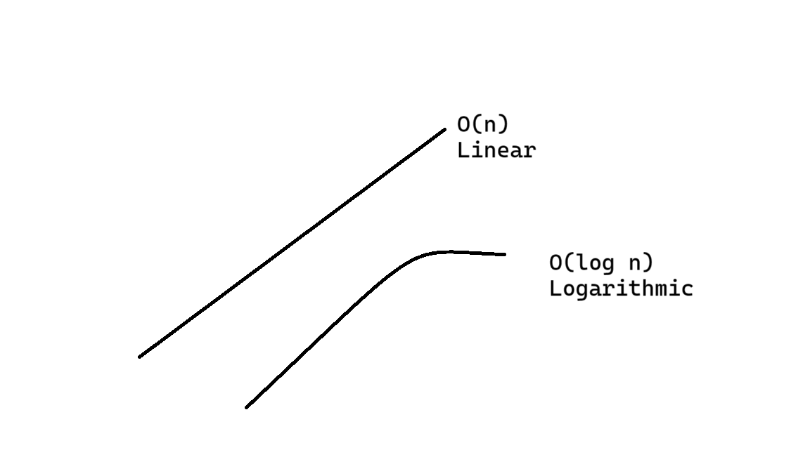

# Big O Notation

Big O describes the performance of an algorithm as the input grows larger. It checks whether the algorithm is scalable as the input size is increased. **O** is for **Order of magnitude of complexity**. **(n)** is for **A function of the size**.

**Notation:** O(n)

- ## O(1) Example Constant time

```python
nums: list[int] = [11,46,15,27,30]
print(nums[2])
```

This code has only one operation and it runs within constant time. The list size here doesn't matter or effect the time complexity. The Big O of this code is `O(1)`.

- ## O(n) Example

```python
nums: list[int] = [11,46,15,27,30]
for num in nums:
    print(num)
```

Now, in this code size of input matters. Time complexity of this algo is O(n). Where n is the number of items in the list.

- ## O(n<sup>2</sup>)

Nested loops has the time complexity of O(n<sup>2</sup>). It depends on the size of input. If there are three loops nested then, the time complexity will be O(n<sup>3</sup>).

## Growth Rates

### Constant Time (O(1))

- **Definition**: Algorithms with fixed execution time, irrespective of input size.
- **Purpose**: Highly efficient for quick operations.

### Linear Time (O(n))

- **Definition**: Execution time proportional to input size.
- **Purpose**: Suitable for scalable tasks with linear growth.

### Logarithmic Time (O(log n))

- **Definition**: Divides input into smaller portions with each step.
- **Purpose**: Efficient for large datasets with quick access.

### Polynomial Time (O(n<sup>k</sup>))

- **Definition**: Execution time increases with input size, governed by the degree 'k'.
- **Purpose**: Useful for problems with known polynomial growth rates.

### Exponential Time (O(2<sup>n</sup>))

- **Definition**: Execution time grows exponentially with input size.
- **Purpose**: Impractical for large inputs due to rapid growth.

### Logarithmic

Logarithmic time algo is efficient and scalable than linear time.



### Exponential

Exponential is the inverse of logarithmic time, it is slow and not scalable for large inputs.

### Growth Rates Big (O)

<table>
    <thead>
        <th>Name</th>
        <th>Notation</th>
    </thead>
    <tbody>
        <tr>
            <td>Constant</td>
            <td>0 (1)</td>
        </tr>
        <tr>
            <td>logarithmic</td>
            <td>O (log n)</td>
        </tr>
        <tr>
            <td>linear</td>
            <td>O (n)</td>
        </tr>
         <tr>
            <td>quadratic</td>
            <td>O (n<sup>2</sup>)</td>
        </tr>
         <tr>
            <td>exponential</td>
            <td>O(2<sup>n</sup>)</td>
        </tr>
    </tbody>
</table>


